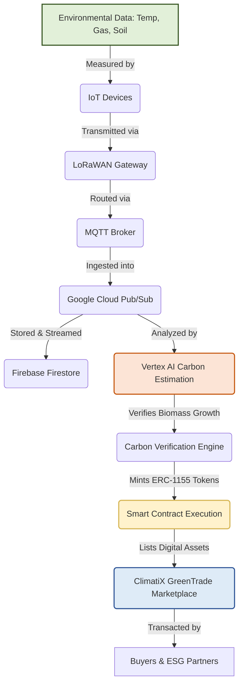

x# ClimatiX: Engineering a Transparent, Trustworthy, and Scalable Carbon Economy

## 1. Introduction

ClimatiX is a pioneering, end-to-end climate technology ecosystem designed to bridge the gap between ecological conservation and modern finance. At its core, ClimatiX aims to bring unprecedented transparency, trust, and global accessibility to the voluntary carbon credit market. By integrating the Internet of Things (IoT), Cloud Computing, Artificial Intelligence (AI), and Blockchain technology, the ecosystem transforms raw environmental telemetry from remote conservation areas into high-integrity, verifiable, and tradable digital carbon assets. 

Rather than relying on legacy, manual, and opaque verification methods, ClimatiX establishes a continuous data-to-token pipeline. This ensures that every carbon credit bought, sold, or retired is backed by actual, real-time ecological measurements. Designed for investors, environmental judges, enterprise partners, and conservation project owners, ClimatiX provides the technical infrastructure required to build a verifiable and scalable green economy.

---

## 2. The Problem

The voluntary carbon market (VCM) is a critical tool in the global fight against climate change, yet it is currently crippled by systemic inefficiencies and a lack of credibility:

*   **Lack of Transparency:** Buyers often have no visibility into whether their investment is actually resulting in new carbon sequestration or forest preservation.
*   **Greenwashing:** Organizations frequently purchase cheap, unverified offsets to make misleading claims about their sustainability status without driving real ecological impact.
*   **Double Counting:** The same carbon offset is sometimes sold to multiple buyers or claimed by multiple countries due to fragmented, siloed registry systems.
*   **Fragmented Monitoring Systems:** Monitoring efforts are scattered, inconsistent, and fail to provide a unified overview of conservation projects.
*   **Manual Verification Processes:** Verifying carbon absorption historically relies on manual tree-measuring audits conducted only once every few years. These audits are slow, expensive, prone to error, and open to manipulation.
*   **Limited Accessibility:** Small-scale conservation projects face prohibitive costs to list their credits, while small businesses and individuals are excluded from direct participation due to complex, broker-heavy onboarding.

### How ClimatiX Solves the Crisis

ClimatiX addresses these challenges by replacing subjective, periodic audits with continuous, machine-certified data. By monitoring environmental metrics in real-time, analyzing carbon capacity with machine learning, and writing all transaction histories to an immutable public blockchain ledger, ClimatiX prevents double counting, eliminates greenwashing, automates the verification bottleneck, and opens the market to global participants of all sizes.

---

## 3. ClimatiX Ecosystem

The ClimatiX ecosystem is divided into three seamlessly integrated platforms that handle data collection, intelligent analytics, and secure asset trading.

```
┌──────────────────────┐      ┌──────────────────────┐      ┌──────────────────────┐
│  ClimatiX Devices    │ ───> │   ClimatiX LandHub   │ ───> │  ClimatiX GreenTrade  │
│  (IoT Telemetry)     │      │   (AI Dashboard)     │      │ (Blockchain Market)  │
└──────────────────────┘      └──────────────────────┘      └──────────────────────┘
```

### 1. ClimatiX Devices (IoT Telemetry)
Deployed directly on the ground in protected forests, wetlands, and conservation projects, ClimatiX Devices are low-power, rugged hardware units. 
*   **Parameters Tracked:** They continuously measure microclimate dynamics, including ambient **temperature**, air **humidity**, **soil moisture**, **gas concentrations** (such as $CO_2$ and volatile organic compounds), and overall **environmental conditions**.
*   **Transmission Protocol:** Sensor data is broadcast locally using long-range radio signals (**LoRaWAN**) to gateway nodes, which then forward the payloads to cloud servers using the lightweight **MQTT** protocol. This setup guarantees autonomous, off-grid operation for years.

### 2. ClimatiX LandHub (AI Dashboard)
ClimatiX LandHub is the central management and intelligence engine of the ecosystem. It acts as a digital twin for all monitored land parcels.
*   **Real-Time Visualization:** Project owners, auditors, and investors can monitor live sensor streams via interactive charts and heatmaps.
*   **AI-Powered Analytics:** By running regression models and spatial analytics, LandHub estimates biomass density and carbon sequestration levels.
*   **Project & Insight Management:** It translates raw physical signals into actionable environmental insights, enabling proactive threat detection (e.g., illegal logging or forest fires) and precise project reporting.

### 3. ClimatiX GreenTrade (Carbon Marketplace)
ClimatiX GreenTrade is a decentralized, secure carbon credit marketplace built on public ledger technology.
*   **Tokenized Credits:** Every metric ton of verified carbon dioxide sequestered is minted as a digital token.
*   **Transparent Ownership & Digital Trading:** The entire lifecycle of a carbon credit—from creation to transfer, and eventual retirement (burning)—is recorded on-chain, making ownership records transparent and audit trails permanent.
*   **ESG Reporting:** Corporations can manage their carbon offset portfolios, monitor transaction histories, and export tamper-proof environmental reports for compliance and public relations.

---

## 4. Technology Stack & Architectural Rationale

Every layer of the ClimatiX architecture is selected to solve specific technical challenges inherent in remote environmental monitoring and decentralized finance.

```
┌────────────────────────────────────────────────────────────────────────────────────────┐
│                                    THE TECH STACK                                      │
├───────────────────┬──────────────────────────────────┬─────────────────────────────────┤
│ Layer             │ Technologies                     │ Key Function                    │
├───────────────────┼──────────────────────────────────┼─────────────────────────────────┤
│ Edge Ingestion    │ IoT, LoRaWAN, MQTT               │ Off-grid telemetry collection   │
├───────────────────┼──────────────────────────────────┼─────────────────────────────────┤
│ Cloud & Analytics │ GCP, Cloud Pub/Sub, Vertex AI   │ Scalable queuing & carbon modeling│
├───────────────────┼──────────────────────────────────┼─────────────────────────────────┤
│ Application Data  │ Firebase Firestore               │ Real-time UI data synchronization│
├───────────────────┼──────────────────────────────────┼─────────────────────────────────┤
│ Trust & Trading   │ Ethereum / ERC-1155, Smart Contracts, NFTNature | Immutable registries & asset fractionalization │
└───────────────────┴──────────────────────────────────┴─────────────────────────────────┘
```

### Edge Ingestion & Transmission

#### Internet of Things (IoT)
*   **Why Selected:** Ground-truth data is the only defense against greenwashing. IoT sensors capture actual physical changes in soil chemistry, moisture, and air quality directly under the forest canopy.
*   **System Contribution:** Replaces infrequent, subjective human audits with high-frequency, objective telemetry.

#### LoRaWAN (Long Range Wide Area Network)
*   **Why Selected:** Forests and conservation zones are almost always outside cellular (4G/5G) coverage. LoRaWAN operates on sub-GHz, license-free radio bands, enabling communication over distances up to 15 km in challenging terrain. It also consumes very little power.
*   **System Contribution:** Allows nodes to run on small solar panels or batteries for up to 5–10 years, making large-scale sensor meshes economically viable.

#### MQTT (Message Queuing Telemetry Transport)
*   **Why Selected:** MQTT uses a publish-subscribe architecture with a tiny packet footprint, minimizing bandwidth usage over cell-connected gateways.
*   **System Contribution:** Ensures reliable data transmission even over weak or intermittent network connections.

---

### Cloud Ingestion & AI Analytics

#### Google Cloud Platform (GCP)
*   **Why Selected:** GCP offers robust, enterprise-grade cloud services, a global footprint, and security controls that comply with international standards.
*   **System Contribution:** Serves as the backbone hosting the ingestion, storage, processing, and visualization APIs.

#### Cloud Pub/Sub
*   **Why Selected:** Pub/Sub is a highly scalable, asynchronous messaging queue. It absorbs bursty ingestion spikes without slowing down the edge devices.
*   **System Contribution:** Decouples edge devices from database storage and AI processing queues, ensuring that no sensor data is lost even during high-frequency transmission.

#### Vertex AI
*   **Why Selected:** Calculating biomass carbon absorption requires combining ground-truth telemetry with satellite imagery. Vertex AI provides the infrastructure to build, train, and run machine learning models.
*   **System Contribution:** Analyzes satellite image history alongside sensor metrics to compute carbon sequestration estimates. This replaces manual auditing with automated, science-backed verification.

---

### Real-Time Application Layer

#### Firebase Firestore
*   **Why Selected:** Firestore is a flexible, real-time NoSQL document database. It automatically syncs data across connected clients using WebSockets.
*   **System Contribution:** Provides the backend database for ClimatiX LandHub, enabling project dashboards to update instantly as soon as a sensor packet reaches the cloud.

---

### Blockchain Trust & Asset Layer

#### Public Blockchain & Smart Contracts
*   **Why Selected:** Traditional carbon registries are centralized, opaque, and susceptible to administrative errors or fraud. A public blockchain provides a decentralized ledger that cannot be altered.
*   **System Contribution:** Establishes a transparent registry of carbon credits, enforcing rules for minting, transferring, and retiring assets.

#### ERC-1155 Multi-Token Standard
*   **Why Selected:** The ERC-1155 standard supports both Non-Fungible Tokens (NFTs) and Fungible Tokens within a single smart contract.
*   **System Contribution:**
    *   **Fungible Assets:** Each carbon credit token represents 1 metric ton of sequestered $CO_2$. These are interchangeable, liquid, and easily tradable.
    *   **Non-Fungible Assets:** Each conservation project or land parcel is minted as a unique token, containing immutable metadata about its location, size, and boundaries.

#### NFTNature
*   **Why Selected:** NFTNature is a conceptual digital certificate that acts as a "digital twin" for physical land.
*   **System Contribution:** Links real-time environmental data (like soil moisture and carbon output) directly to a specific NFT. This ensures that the digital token's value is directly tied to the actual health and performance of the physical forest it represents.

---

## 5. End-to-End Workflow

The path from a physical carbon sink to a verified digital trade runs through an automated, secure pipeline:



1.  **Data Acquisition:** Ground sensors measure temperature, humidity, soil moisture, and $CO_2$ levels under the forest canopy.
2.  **Edge Routing:** The sensor packet is transmitted via LoRaWAN to a local gateway. The gateway forwards it to the cloud using MQTT.
3.  **Cloud Ingestion:** GCP Pub/Sub receives the telemetry and routes it to Firebase Firestore for real-time dashboard display.
4.  **AI Analysis:** Vertex AI combines the telemetry with satellite imagery to compute the net carbon sequestered during the period.
5.  **Smart Contract Verification:** Once the carbon sequestration meets verification thresholds, a smart contract is triggered.
6.  **Tokenization:** The smart contract mints ERC-1155 tokens (carbon credits) linked to the corresponding NFTNature land profile.
7.  **Market Listing:** The minted carbon credits are listed on ClimatiX GreenTrade, where buyers can purchase and retire them transparently.

---

## 6. Key Innovations

ClimatiX introduces several key innovations that distinguish it from traditional carbon offset programs:

*   **Continuous Ground-Truth Monitoring:** Replaces estimates with direct measurements of soil chemistry, gas emissions, and microclimates.
*   **Data-Driven AI Verification:** Automates auditing by running machine learning models on a combination of ground sensors and satellite imagery.
*   **Double-Counting Prevention:** Uses public blockchain ledgers to ensure that once a credit is retired, it is permanently locked and cannot be resold.
*   **Fractionalized Asset Ownership:** The ERC-1155 standard allows large conservation projects to be fractionalized into smaller, affordable units.
*   **A Unified, Scalable Architecture:** Connects low-power hardware, high-throughput cloud queues, machine learning engines, and blockchain markets into a single, automated workflow.

---

## 7. Project Goals & Objectives

The development and deployment of ClimatiX are guided by clear milestones aimed at transforming the climate tech sector:

*   **Improving Carbon Market Transparency:** Providing buyers with clear, auditable evidence of their environmental impact.
*   **Supporting ESG Implementation:** Enabling corporations to meet Environmental, Social, and Governance (ESG) requirements using auditable, real-time data.
*   **Reducing Greenwashing:** Eradicating unverified offsets from the market by enforcing continuous monitoring.
*   **Accelerating Net-Zero Emissions:** Streamlining the flow of capital to high-quality carbon offset projects worldwide.
*   **Empowering Local Communities:** Allowing small-scale land owners and conservation projects to list carbon credits directly, without expensive brokers.
*   **Making Carbon Credits Accessible:** Lowering entry barriers so that individuals and small businesses can participate in carbon trading.

---

## 8. Closing

ClimatiX is more than just a carbon marketplace—it is an integrated digital ecosystem. By connecting environmental monitoring, artificial intelligence, cloud computing, and blockchain technology, ClimatiX builds a trusted, transparent, and scalable carbon economy. As global standards for carbon accounting tighten, the platform's ability to turn raw physical telemetry into high-integrity digital assets makes it a vital tool for building a sustainable future.
